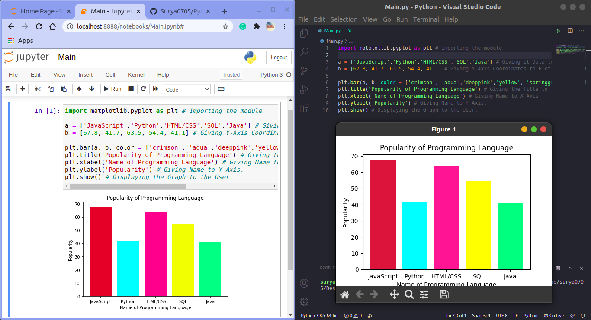

# Python_Graph_Plotter
In this Repository I have shown you how to Plot the Bar Graphs Using Python. It uses 'matplotlib' module to do so. To install that Module just type the following in your CMD/Powershell/Terminal (Assuming that You are on Windows):
```
pip install matplotlib
```
Or if you are in Linux(Ubuntu 20.04 LTS which I am using) then use:
```
pip3 install matplotlib
```
Or install according to your OS. After Installation You can yourself Plot Data as per your will. Also this data plotting works on both Online IDEs such as Google Colab and Jupyter Notebook. For Normal usage just run [Main.py](Main.py) file and to run it in your Browser just use [Main.ipynb](Main.ipynb). Below is the Screenshot of My Program:

And Hope that you Liked it!
